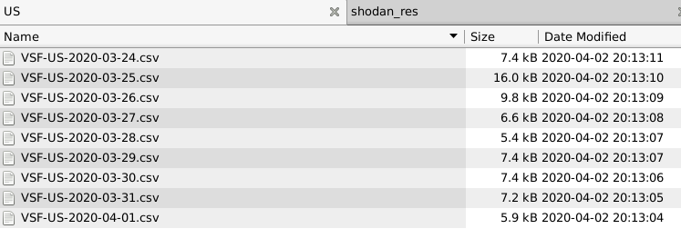

# PRIVATE_Medical_infra_vuln
Repo for Channel #2-medical-infra-vuln-stream

<TLP:AMBER>

## info

enriched and by_country_separated list of IPs,
taken from the stream #2-medical-infra-vuln-stream

what you find here:

- lists from vulnerable hosts, attributed to medical/hospital-orgs, based on keywords in their hostnames or network-info
- the lists are separated by country and generated for each day
- these are not IOCs

target_audience:

- nat-certs
- health-certs
- telcos

how the data is compiled:

- take all the infos from the vuln-stream,w hich is an excerpt from shodan-scans 
- separate the IPs by country for easy managemend for nat-certs (relies on geoip, which might be incorrect from time to time)
- store a daily summary in each country's folder VULN_STREAM_FIREHOSE/[Country_Code]/VSF-[CN]-[DATE].csv

fileformat:

~~~

IP;ASN;{CVEs};[Ports];Time;AS_Desc
12.227.80.40;7018;{'CVE-2019-19781': 'Citrix RCE (Shitrix)'};[80, 443];2020-03-29 20:27:37;AT&T Services
12.8.127.35;7018;{'CVE-2019-19781': 'Citrix RCE (Shitrix)'};[443];2020-03-29 17:24:06;AT&T Services
128.253.148.195;26;{'CVE-2019-19781': 'Citrix RCE (Shitrix)'};[443];2020-03-29 17:09:39;Cornell University
143.104.238.236;395139;{'MS17-010': 'MS17-010'};[445, 3389];2020-03-29 15:19:18;NewYork-Presbyterian Hospital
150.198.1.67;53352;{'CVE-2019-11510': 'PulseSecure VPN RCE'};[80, 443];2020-03-29 19:42:43;Henry Ford Health System
150.198.1.98;53352;{'CVE-2019-11510': 'PulseSecure VPN RCE'};[80, 443];2020-03-29 16:51:31;Henry Ford Health System
155.139.187.250;25609;{'CVE-2019-19781': 'Citrix RCE (Shitrix)'};[443];2020-03-29 17:06:37;Detroit Medical Center
162.210.7.174;15108;{'CVE-2019-0708': 'Windows RDP RCE (BlueKeep)'};[80, 443, 3389];2020-03-29 15:41:42;Allo Communications LLC
165.234.130.214;6263;{'CVE-2020-0796': 'MS SMBv3 RCE'};[445];2020-03-29 16:12:47;State of North Dakota
173.14.89.218;7922;{'CVE-2019-0708': 'Windows RDP RCE (BlueKeep)'};[3389];2020-03-29 19:41:35;Comcast Business
184.10.85.4;5650;{'CVE-2019-19781': 'Citrix RCE (Shitrix)'};[443];2020-03-29 15:52:25;Frontier Communications

~~~

this data will get updated daily, automated
changes will be pushed back to this repo 

